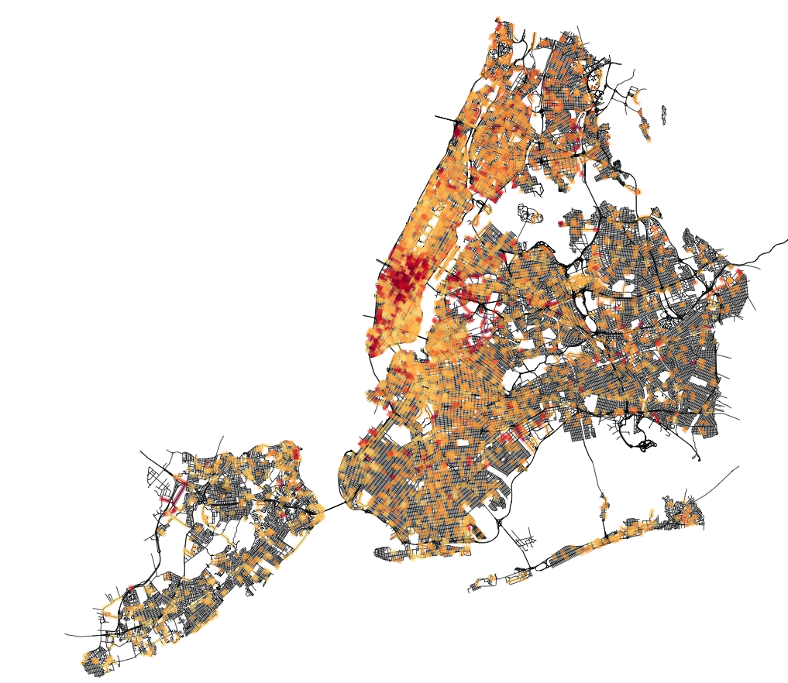

#Objective
##Context
**The idea is to use our original context prediction techniques to profile buildings and predict electricity consumption at the section level.**
For companies the aims are:

- remove energy consumption spikes
- energy clearing strategies (at smaller scale)
- integrate renewable energies in the network
- predict failure before they actually happen (so much less effort/cost, no risk of cascade failure)
- optimize solar/wind generators positioning
- spot and cure electricity precariousness (15% of income for elec., 8M people in France)
- optimize the resources, especially for an aging network

Buildings are the principal consumers of electricity: 800 TWh/y over the 1800 produced.

EDF is willing to work with startups to address these problems. They are actually working with statistical techniques far behind what we can achieve. 

##Our approach
Everybody is working with pure electric datas. We add to this the context layer to say that this block is more likely to fail between this and this hour because it contains this an this types of buildings.

#Work done
##1) Predicting electricity parameters at the scale of the section:

From a dataset containing the efficiency of electricity consumption in a few thousands buildings in NYC, I infer the efficiency by section everywhere else (when we have buildings from OSM)

The areas of high efficiency are correlated with the area of high consumption given by a completely different approach:
http://modi.mech.columbia.edu/nycenergy/

##2) What features are important to predict electricity consumption in households

The RECS dataset represents 12000 residential houses, with 900 features.
The aim is to find the best feature to have a good pearson score in predicting the electricity consumption.
I'm not going to try each set of 10 parameters out of 900 by hand so i implemented a little framework that loads the data and process it to do selection methods to find the best pearson.

The frame works loads the dat, cleans is normalize it and gathers features that have a correlation > 0.9.

With a genetic optimization (where the chromosome is a set of 10 parameters):

For 50 generations with initial population of 100 and chromosome length of 12 we have interesting results:

1. feature HDD30YR : Heating degree days, 30-year average 1981-2010, base 65F (0.205435)
2. feature REGIONC : Census Region (0.168480)
3. feature Climate_Region_Pub : Building America Climate Region (collapsed for public file) (0.110992)
4. feature CDD65 : Cooling degree days in 2009, base temperature 65F (0.105086)
5. feature TYPEHUQ : Type of housing unit (0.103262)
6. feature CDD30YR : Cooling degree days, 30-year average 1981-2010, base 65F (0.057225)
7. feature DIVISION : Census Division (0.056446)
8. feature HDD65 : Heating degree days in 2009, base temperature 65F (0.051445)
9. feature REPORTABLE_DOMAIN : Reportable states and groups of states (0.049818)
10. feature AIA_Zone : AIA Climate Zone, based on average temperatures from 1981 - 2010 (0.049279)
11. feature KOWNRENT : Housing unit is owned, rented, or occupied without payment of rent (0.029809)
12. feature NWEIGHT : Final sample weight (0.012723)

gives a 0.53 pearson (cross validated)

With a random tree classifier:

1. feature CDD30YR : Cooling degree days, 30-year average 1981-2010, base 65F (0.026213)
2. feature HDD30YR : Heating degree days, 30-year average 1981-2010, base 65F (0.022525)
3. feature TOTSQFT_EN : Total square footage (includes heated/cooled garages, all basements, and finished/heated/cooled attics). Used for EIA data tables. (0.021667)
4. feature REPORTABLE_DOMAIN : Reportable states and groups of states (0.021225)
5. feature TOTROOMS : Total number of rooms in the housing unit (0.020892)
6. feature TEMPHOME : Temperature when someone is home during the day (winter) (0.020350)
7. feature DIVISION : Census Division (0.020302)
8. feature TEMPNITE : Temperature at night (winter) (0.020223)
9. feature YEARMADERANGE : Year range when housing unit was built (0.019898)
10. feature TEMPGONE : Temperature when no on is home during the day (winter) (0.019435)
11. feature WASHLOAD : Frequency clothes washer used (0.017336)
12. feature TVONWE2 : Second most-used TV usage on weekends (0.016552)

gives a 0.54 pearson (cross validated) but i reached 0.56 if i don't merge features (according to their correlations)

And for gas consumption:

1. feature PGASHEAT : Who pays for natural gas for space heating (0.051203)
2. feature PGASHTWA : Who pays for natural gas for water heating (0.048744)
3. feature ELWATER : Electricity used for water heating (0.043318)
4. feature PUGCOOK : Who pays for natural gas for cooking (0.033363)
5. feature PELHOTWA : Who pays for electricity used for water heating (0.022673)
6. feature PELHEAT : Who pays for electricity used for space heating (0.020063)
7. feature PELCOOK : Who pays for electricity used for cooking (0.019855)
8. feature HDD30YR : Heating degree days, 30-year average 1981-2010, base 65F (0.018038)
9. feature CDD30YR : Cooling degree days, 30-year average 1981-2010, base 65F (0.017904)
10. feature TEMPHOME : Temperature when someone is home during the day (winter) (0.016998)
11. feature REPORTABLE_DOMAIN : Reportable states and groups of states (0.016887)
12. feature YEARMADERANGE : Year range when housing unit was built (0.016644)

gives à 0.69 pearson (cross validated)

The code is really plug and play and could be used to get insights on any new big dataset with lots of features.

TODO for a presentation illustrate the 900 feature and show how hard it is to infer what is meaningful

##3) Predicting dynamic exchange between european countries

Here I try to learn daily exchange of electricity between european countries. The features are:

1) day of year
2) source
3) target
4) temp_source 
5) temp_target
6) oil quote of the day
7) coal quote of the day

for 4 countries I get a 0.63 pearson score.

#To do